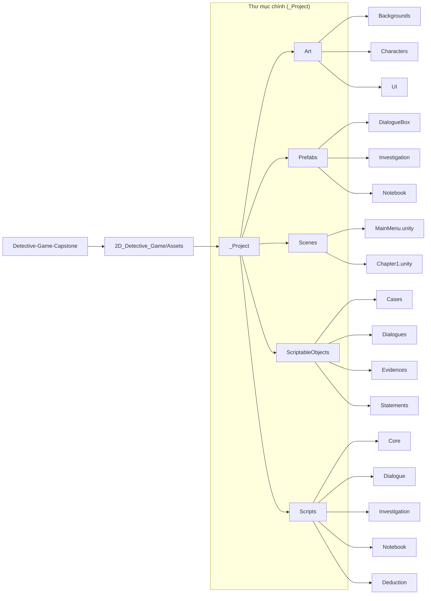

# Detective-Game-Capstone
2D Detective Adventure Game

HƯỚNG DẪN LẬP TRÌNH & QUẢN LÝ CODE CHO CODER
1. Lần đầu tiên: Lấy dự án về máy (Chỉ làm 1 lần duy nhất)
Nếu bạn chưa có source code trên máy tính, hãy mở Git Bash (hoặc Terminal) tại thư mục bạn muốn chứa project và chạy lệnh:

Bash
# 1. Tải toàn bộ mã nguồn từ GitHub về máy
git clone https://github.com/Hardyex/Detective-Game-Capstone.git

# 2. Di chuyển vào thư mục dự án
cd Detective-Game-Capstone

# 3. Chuyển sang nhánh dev (nhánh làm việc chung của nhóm)
git checkout dev
2. Mở dự án bằng Unity Editor
Mở phần mềm Unity Hub.

Nhấn nút Add (hoặc Add project from disk).

Trỏ đường dẫn đến thư mục: Detective-Game-Capstone/2D_Detective_Game/ và bấm chọn.

Click vào project vừa thêm để mở lên bằng đúng phiên bản Unity mà nhóm đang dùng. (Lưu ý: Thư mục Library/ và Temp/ sẽ tự động sinh ra trên máy bạn và đã được file .gitignore chặn lại, không lo bị push nhầm).

3. Trước mỗi khi bắt đầu viết code mới (Rất quan trọng!)
Để tránh bị xung đột (conflict) code với các thành viên khác, luôn luôn cập nhật code mới nhất từ nhánh dev về máy trước:

Bash
git checkout dev
git pull origin dev
Sau đó, tạo một nhánh tính năng (feature branch) riêng cho phần việc bạn chuẩn bị làm (ví dụ bạn làm hệ thống hội thoại - Dialogue):

Bash
git checkout -b feature/dialogue-system
4. Tiến hành code trong Unity
Viết code và chỉnh sửa các file thuộc thư mục mã nguồn cá nhân: 2D_Detective_Game/Assets/_Project/

Sau khi code xong, hãy chạy thử (Play mode) trong Unity Editor để đảm bảo không có lỗi đỏ (Error) nào xuất hiện.

5. Đẩy code lên GitHub sau khi hoàn thành tính năng
Khi đã code xong và test chạy ngon lành, bạn thực hiện đẩy code theo đúng các bước sau:

Bash
# Bước 1: Kiểm tra lại các file bạn đã thay đổi
git status

# Bước 2: Add chọn lọc thư mục mã nguồn (TUYỆT ĐỐI KHÔNG DÙNG git add .)
git add 2D_Detective_Game/Assets/_Project/

# (Nếu có sửa file cấu hình Unity quan trọng thì add thêm dòng này, còn không thì bỏ qua)
# git add 2D_Detective_Game/ProjectSettings/

# Bước 3: Lưu lại commit kèm theo thông điệp rõ ràng theo chuẩn
git commit -m "feat(dialogue): implement dialogue typing UI system"

# Bước 4: Đẩy nhánh tính năng của bạn lên GitHub
git push origin feature/dialogue-system
(Quy ước viết tên commit message: feat(...) cho tính năng mới, fix(...) cho sửa lỗi, ui(...) cho giao diện).

6. Tạo Pull Request (PR) để gộp code vào nhánh chung
Sau khi chạy lệnh git push ở trên, hãy truy cập vào trang GitHub của dự án: Detective-Game-Capstone trên GitHub.

GitHub sẽ hiển thị thông báo "Compare & pull request". Bạn hãy bấm vào nút đó.

Đặt tiêu đề cho Pull Request mô tả ngắn gọn bạn đã làm được gì.

Chọn hướng gộp code: từ nhánh feature/dialogue-system vào nhánh dev.

Nhấn Create Pull Request và thông báo cho nhóm trưởng (Minh Hoàng) vào review/kiểm tra và bấm Merge code vào nhánh chung!

❌ Những điều tuyệt đối phải tránh:
Không bao giờ dùng git add . (tránh làm đơ máy hoặc lôi các thư mục tạm Temp/, Library/ lên GitHub).

Không bao giờ code trực tiếp trên nhánh main hay dev mà phải làm trên nhánh feature/... của riêng mình.
